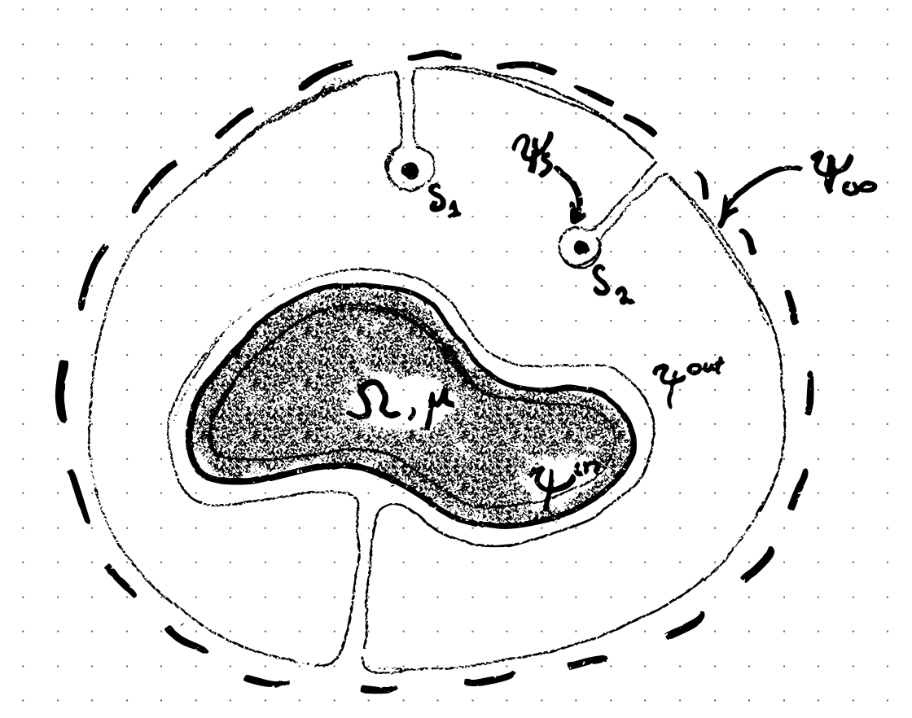

# Theory and introduction

Since ancient times people had wondered what makes amber rubbed with fur to attract small light objects and what makes lodestones, naturally magnetized pieces of the mineral magnetite, to attract iron. Nowadays we do have an answer that the force comes from magnetization or polarization gradient. However, even for linear materials, the computation of the force is challenging as the body itself perturbs the field. Fortunately, boundary integral methods can save our day [^1], which are implemented in this library and can be used to calculate the field and so also a force at an arbitrary object's surface.

To start with we introduce a potential ψ whose gradient is either electric or magnetic field. In the absence of singularities (charges, dipoles and etc.) the potential satisfies Laplace equation Δψ=0. It is well known from the Green theorem that Laplace equation can also be written in integral form:
```math
\int_{\partial \Omega} \frac{\partial \psi}{\partial n_{\boldsymbol x}} \frac{1}{|\boldsymbol x - \boldsymbol y|} dS_{\boldsymbol{x}}
-\int_{\partial \Omega} \psi(\boldsymbol x) \frac{\partial}{\partial n_{\boldsymbol x}} \frac{1}{|\boldsymbol x - \boldsymbol y|} dS_{\boldsymbol{x}}
=\left\{
    \begin{array}{ll}
      4\pi \psi(\boldsymbol y) ~&if~\boldsymbol{y} \in \Omega \\
      2 \pi \psi(\boldsymbol y)~&if~\boldsymbol{y} \in \partial \Omega \\
      0 ~&if~\boldsymbol{y} \ni \Omega 
    \end{array}
  \right.
```
This integral is flexible in the sense that we can wrap the surface around singularities, infinity and objects, and we can apply it to the interior of objects with linear properties.

Let's consider the system shown in the figure:



We have singularities denoted by $S_n$, object $\Omega$ and infinity $\infty$. Since at infinity the field perturbation from the object is vanishingly small we can set it equal to the free field. Similarly, the field near the singularity approaches the field of the singularity, and we can neglect the effects of the body. Thus we have an identity:
```math
  \int_{\partial \infty} + \int_{\partial S} = 4 \pi \psi_{0} (\boldsymbol y)
```
where the left side is integral over the surface of singularities and infinity, and the right side is the field in the absence of bodies.

To model the field in the presence of bodies, we only need to set appropriate boundary conditions, which are:
```math
\begin{array}{rcl}
\psi^{in} = \psi^{out} = \psi && \mu \frac{\partial \psi^{in}}{\partial n} = \frac{\partial \psi^{out}}{\partial n} = \frac{\partial \psi}{\partial n}
\end{array}
```
which implies a linear material. Applying the boundary integral to the interior of the object and matching boundary conditions with the exterior surface, we arrive at the useful formula:
```math
\int_{\partial \Omega} \frac{\partial \psi^{out}}{\partial n_x} \frac{1}{|\boldsymbol x - \boldsymbol y|} dS_{\boldsymbol x} = \frac{2 \mu}{\mu + 1} \int_{\partial \Omega} \psi(\boldsymbol x) \frac{\partial}{\partial n_{x}} \frac{1}{|\boldsymbol x - \boldsymbol y|} dS_{\boldsymbol x}
```
That we can use to obtain a boundary integral equation for the potential:
```math
  \psi(\boldsymbol y) = 2 \psi_{0}(\boldsymbol y)  + \frac{\mu - 1}{\mu + 1} \int_{\partial \Omega} (\psi(\boldsymbol x)-\psi(\boldsymbol y)) \frac{\partial}{\partial n_x} \frac{1}{|\boldsymbol x - \boldsymbol y|} dS_{\boldsymbol x}
```
where we used identity $\int_{\partial \Omega} \frac{\partial}{\partial n_x} \frac{1}{|\boldsymbol x - \boldsymbol y|} dS_{\boldsymbol x}=0$ for regularization.

Another way of writing the Laplace equation in the BIE form is as follows:
```math
\int_{\partial \Omega} (\nabla_{\boldsymbol x} \psi \times \boldsymbol n_{\boldsymbol x}) \nabla_x \frac{1}{|\boldsymbol x - \boldsymbol y|} dS_{\boldsymbol{x}}
-\int_{\partial \Omega} \frac{\partial \psi}{\partial n_{\boldsymbol x}} \nabla_{\boldsymbol x}  \frac{1}{|\boldsymbol x - \boldsymbol y|} dS_{\boldsymbol{x}}
=\left\{
    \begin{array}{ll}
      4\pi \nabla \psi(\boldsymbol y) ~&if~\boldsymbol{y} \in \Omega \\
      2 \pi \nabla \psi(\boldsymbol y)~&if~\boldsymbol{y} \in \partial \Omega \\
      0 ~&if~\boldsymbol{y} \ni \Omega 
    \end{array}
  \right.
```
From a similar argument, we obtain
```math
  \int_{\partial \infty} + \int_{\partial S} = 4 \pi \nabla \psi_{0} (\boldsymbol y)
```
And from boundary conditions, we can get a formula:
```math
\boldsymbol n_{\boldsymbol y} \cdot \int \frac{\partial \psi}{\partial n} \nabla_{\boldsymbol x} \frac{1}{|\boldsymbol{x} - \boldsymbol{y}|} dS_{\boldsymbol x} = \frac{\mu + 1}{2} \boldsymbol n_{\boldsymbol y} \int (\nabla \psi \times \boldsymbol n_{\boldsymbol x}) \nabla_{\boldsymbol x} \frac{1}{|\boldsymbol{x} - \boldsymbol{y}|} dS_{\boldsymbol x}
```
That we substitute back to obtain:
```math
  \frac{\partial \psi^{in}}{\partial n_{\boldsymbol y}} = 2 \nabla \psi_0 \cdot \boldsymbol n_{\boldsymbol y} - \frac{\mu -1}{4 \pi} \boldsymbol n_{\boldsymbol y} \cdot \int (\nabla \psi \times \boldsymbol n_{\boldsymbol x}) \times \nabla_{\boldsymbol x} \frac{1}{|\boldsymbol{x} - \boldsymbol{y}|} dS_{\boldsymbol x}
```
which corresponds to a Biot-Savarat integral over the surface current. In numerics, a regularized version is used (for derivation see [^1]):
```math
  \frac{\partial \psi^{in}}{\partial n_{\boldsymbol y}} = 2 \nabla \psi_0 \cdot \boldsymbol n_{\boldsymbol y} - \frac{\mu -1}{4 \pi} \boldsymbol n_{\boldsymbol y} \cdot \int (P\nabla \psi(\boldsymbol x) - P \nabla \psi (\boldsymbol y) ) \times \left( \boldsymbol n_{\boldsymbol x} \times \nabla_{\boldsymbol x} \frac{1}{|\boldsymbol{x} - \boldsymbol{y}|} \right) dS_{\boldsymbol x}
```

# Implementation and API

The boundary integral equations are solved with the collocation method on a triangular mesh. The simplest quadrature ∫ΔfdS=(f1+f2+f3)/3 is used for all nonsingular elements. Whereas for Biot-Savarat integral for normal derivatives, a weakly singular quadrature is implemented to deal with elements near the singularity.  To obtain tangential derivatives of the potential, we do numerical differentiation of previously calculated potential and use least squares to solve the overdetermined system. 

```@autodocs
 Modules = [LaplaceBIE]
```

[^1]: Erdmanis, J. & Kitenbergs, G. & Perzynski, R. & Cebers, A. (2017) Magnetic micro-droplet in rotating field: numerical simulation and comparison with experiment